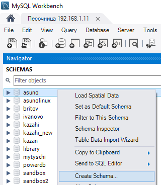
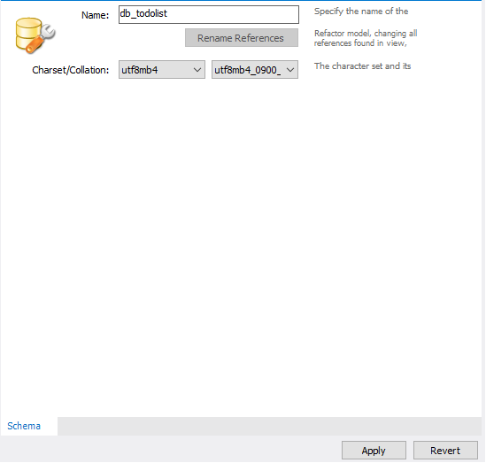
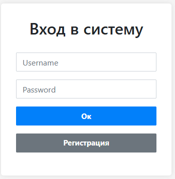
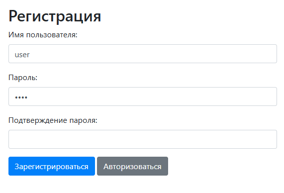
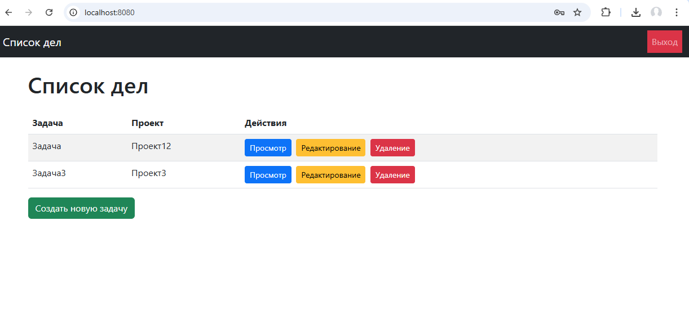
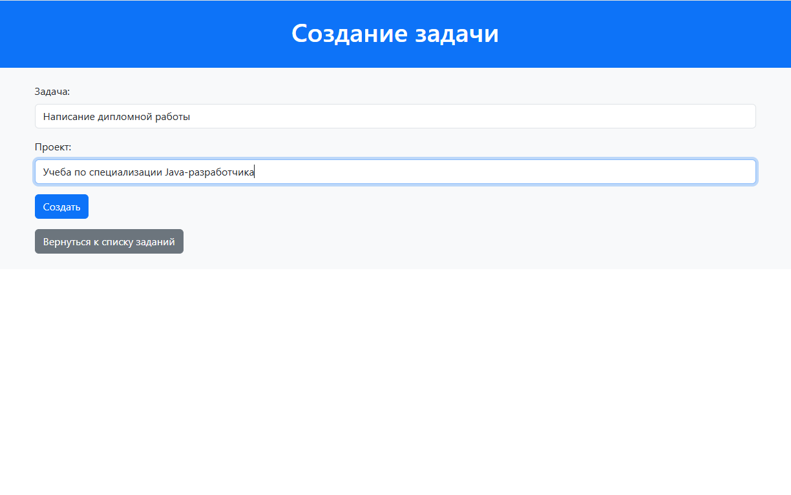
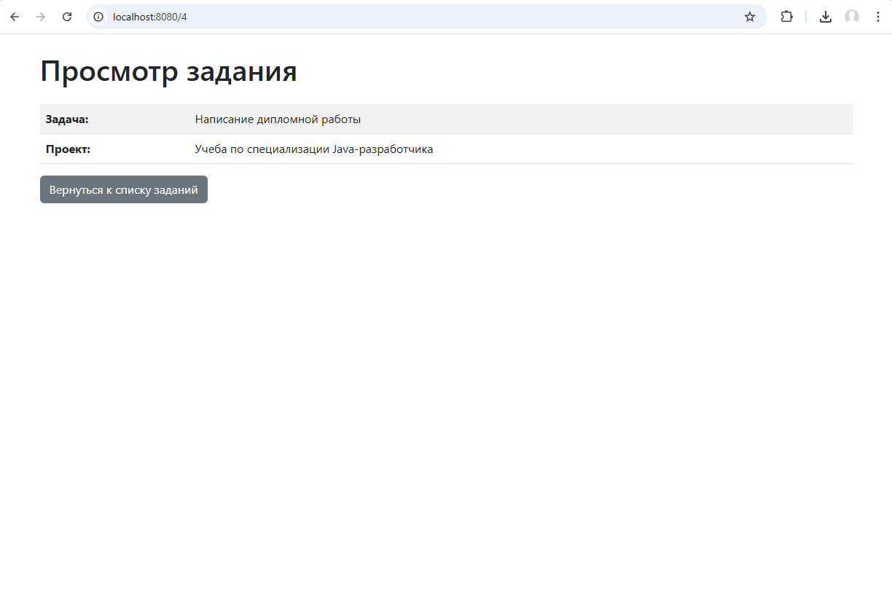
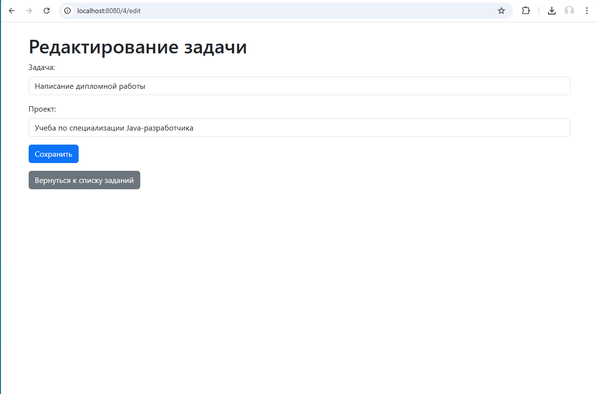

# **Приложение To-Do List на Spring**
Простое приложение для управления списком задач, созданное с использованием Spring Boot, Thymeleaf и Spring Security. Это приложение позволяет пользователям создавать, просматривать, обновлять и удалять задачи в своем списке дел. Также включены функции создания учетной записи и входа в систему.
## **Функциональные возможности**
- **CRUD-операции**: Пользователи могут создавать, просматривать, редактировать и удалять задачи.
- **Создание учетной записи**: Пользователи могут создавать, просматривать, обновлять и удалять задачи.
- **Аутентификация пользователей**: Безопасный вход в систему с использованием Spring Security..
- **Хеширование паролей**: Пароли пользователей надежно хешируются для хранения.
- **Шаблонизация Thymeleaf**: Фронтенд-представления формируются с использованием шаблонов Thymeleaf.
## **Используемые технологии и фреймворки**
- **Spring Boot**: Фреймворк для создания автономных, высокопроизводительных Spring-приложений.
- **Thymeleaf**: Современный серверный Java-шаблонизатор для веб- и автономных сред.
- **Spring Security**: Мощный и настраиваемый фреймворк для аутентификации и контроля доступа.
- **Spring Data JPA**: Упрощает доступ к данным и их сохранение с использованием Java Persistence API.
- **Hibernate**: Инструмент для объектно-реляционного отображения на языке Java.
- **MySQL/PostgreSQL/H2 Database**: Выберите предпочитаемую реляционную базу данных для хранения.
## **Быстрый старт настройки и работы в приложении**
### **Предустановленное программное обеспечение**
- Java JDK (8 или выше)
- Maven
- Your preferred IDE (IntelliJ IDEA, Eclipse, etc.)
- MySQL Database (Убедитесь, что она установлена и запущена), также в ней нужно создать пустую базу db\_todolist, например через утилиту MySQL Workbench в дереве схем баз и кликнув на дереве схем баз правой клавишей мыши и выбрав в контекстном меню пункт Create Schema, затем в окне создания схемы базы задать кодировку, можно также запустить MySQL через Docker командой docker-compose up, файлы Docker прилагаются в корневой папке проекта, в них также если используется Docker можно осмотреть параметры соединения с базой:

### **Установка** 
1. Клонируйте репозиторий:

   git clone https://github.com/dobrikovskiy/tasks.git
2. Перейдите в директорию проекта:

   cd tasks
3. Обновите файл application.properties реальными IP-адресом:

   spring.datasource.url=jdbc:mysql://localhost:3306/db\_todolist
   spring.datasource.username=root
   spring.datasource.password=root
4. Соберите проект командой командой:

   `        `mvn clean package
5. Запустите приложение через InteliJ Idea нажав на файле TodoListApplication правой клавишей мыши и выбрав пункт Run или в верхнем правом углу редактора выбрав кнопку Run.
5. Открыть браузер и перейти по адресу http://localhost:8080 чтобы получить доступ к приложению.
## **Использование приложения**
1. **Создание учетной записи**: нажмите на кнопку "Регистрация", чтобы зарегистрироваться и создать учетную запись.
   
   
   
2. **Вход в систему**: После создания учетной записи войдите в систему, используя свои учетные данные.
   
3. **Управляйте задачами**: Добавляйте, просматривайте, редактируйте, удаляйте задачи через кнопки добавления, редактирования, удаления, просмотра задач.
   
   
   
   
